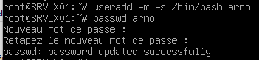
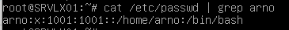
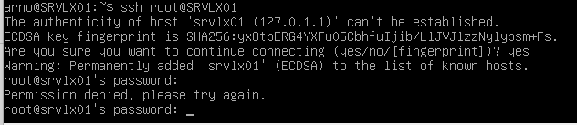
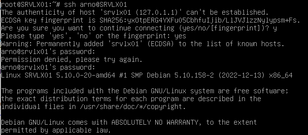
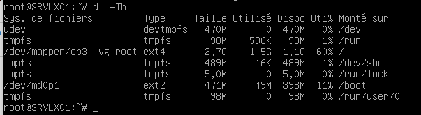
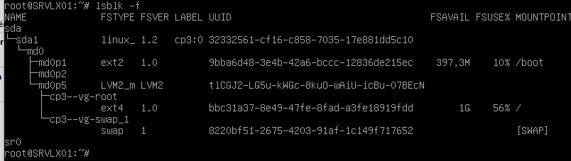
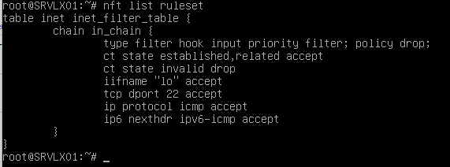
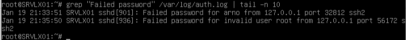

# Exercice 2 : Manipulations pratiques sur VM Linux

# Partie 1 : Gestion des utilisateurs

## Q.2.1.1 Sur le serveur, créer un compte pour ton usage personnel.

```
useradd -m -s /bin/bash arno
passwd arno
```
  
  

## Q.2.1.2 Quelles préconisations proposes-tu concernant ce compte ?

# Partie 2 : Configuration de SSH

## Q.2.2.1 Désactiver complètement l'accès à distance de l'utilisateur root.

```
nano /etc/ssh/sshd_config
```

Ajouter dans le fichier cette ligne:  
```
PermitRootLogin no
```
Sauvegarder et restart:
```
systemctl restart sshd
```

  

## Q.2.2.2 Autoriser l'accès à distance à ton compte personnel uniquement.

```
nano /etc/ssh/sshd_config
```

Ajouter dans le fichier cette ligne:  
```
AllowUsers arno
```
Sauvegarder et restart:
```
systemctl restart sshd
```

  

## Q.2.2.3 Mettre en place une authentification par clé valide et désactiver l'authentification par mot de passe

?

# Partie 3 : Analyse du stockage

## Q.2.3.1 Quels sont les systèmes de fichiers actuellement montés ?

  

## Q.2.3.2 Quel type de système de stockage ils utilisent ?

  

## Q.2.3.3 Ajouter un nouveau disque de 8,00 Gio au serveur et réparer le volume RAID

?

## Q.2.3.4 Ajouter un nouveau volume logique LVM de 2 Gio qui servira à héberger des sauvegardes. Ce volume doit être monté automatiquement à chaque démarrage dans l'emplacement par défaut : /var/lib/bareos/storage.

?

## Q.2.3.5 Combien d'espace disponible reste-t-il dans le groupe de volume ?

?

# Partie 4 : Sauvegardes

## Q.2.4.1 : Rôles des composants Bareos

bareos-dir : Gère les configurations et ordonne les sauvegardes
bareos-sd : S'occupe du stockage des sauvegardes
bareos-fd : ?

# Partie 5 : Filtrage réseau

## Q.2.5.1 Quelles sont actuellement les règles appliquées sur Netfilter ?

  

## Q.2.5.2 Quels types de communications sont autorisées ?

```
ctstate established,related
iifame "lo"
tcp dport 22
ip protocol icmp
ip6 nexthdr ipv6-icmp
```

## Q.2.5.3 Quels types sont interdit ?

```
ct state invalid
```

## Q.2.5.4 : Ajouter les règles pour Bareos

?

# Partie 6 : Analyse de logs

## Q.2.6.1 Lister les 10 derniers échecs de connexion ayant eu lieu sur le serveur en indiquant pour chacun :
- La date et l'heure de la tentative
- L'adresse IP de la machine ayant fait la tentative

  
